# Umico Cosmetics Marketplace — Business Intelligence Report

- **Market:** Azerbaijan · **Platform:** Umico / Birmarket
- **Dataset:** 90,000 active cosmetics & beauty products · **Date:** February 2026

---

## Executive Summary

The Umico cosmetics marketplace is a large, fragrance-heavy, discount-driven platform dominated by third-party sellers. With 90,000 active listings across 199 sub-categories and 992 sellers, the marketplace shows strong seller-side supply but significant untapped customer engagement. Three strategic levers stand out: **reducing reliance on unbranded products**, **activating dormant buyer reviews**, and **expanding the Fulfilled-by-Umico (FBU) program** to capture premium positioning.

---

## 1. Category Landscape — Fragrances Overwhelm Everything Else

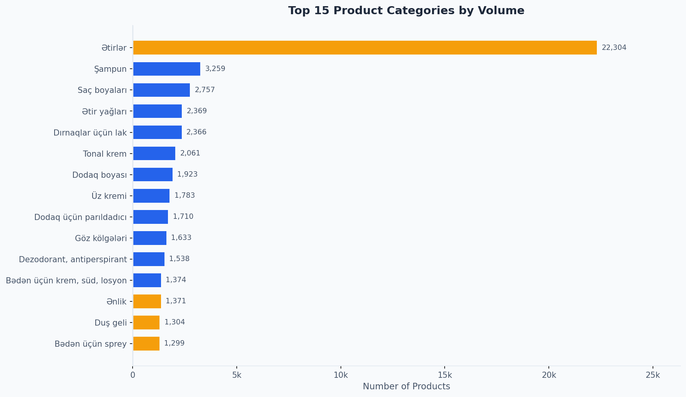

**What the chart shows:** The top 15 categories by number of listed products.

Fragrances (*Ətirlər*) account for **22,304 products — nearly 1 in every 4 listings** on the entire platform. No other category comes close: the second-largest (Shampoo, 3,259 products) is seven times smaller. The top 5 categories together represent roughly 40% of the catalog.

**Why it matters:**
- The platform's identity is disproportionately tied to one category. A demand shift in fragrances — seasonal, economic, or competitive — would have an outsized impact on total revenue.
- Categories like face creams, lip color, eye shadow, and tonal foundations are significantly under-represented relative to their global market share, suggesting a white space for growth.
- **Recommendation:** Actively recruit sellers in skincare, hair care treatment, and color cosmetics to diversify the category mix and reduce concentration risk.

---

## 2. Pricing Architecture — The Mass-Market Sweet Spot

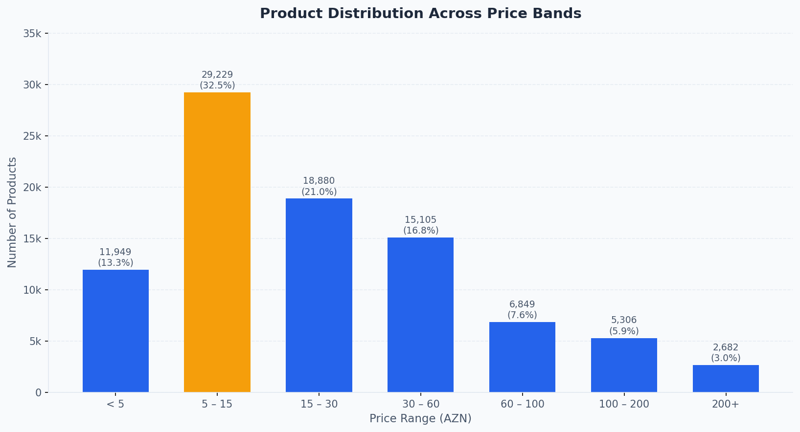

**What the chart shows:** How the 90,000 products distribute across retail price ranges in AZN.

The dominant price band is **5 – 15 AZN, accounting for 32.5% of the catalog (29,229 products)**. Together, sub-30 AZN products make up nearly 67% of all listings. This firmly positions Umico cosmetics as an **affordable, accessible marketplace** — not a luxury or premium destination.

However, a meaningful tail of higher-priced items (100 AZN+, 8,888 products) exists, mostly driven by fragrances, whose average category price is 80.6 AZN.

**Why it matters:**
- The current catalog over-indexes on low-price items. While this drives basket frequency, it limits average order value and platform revenue per transaction.
- The 60 – 200 AZN band (12,155 products, 13.5% of catalog) is under-served relative to consumer purchasing power in the premium beauty segment.
- **Recommendation:** Create a curated premium store-front to elevate higher-value products and attract a different buyer segment without disrupting mass-market offerings.

---

## 3. Discount Strategy — Deep Discounting Is the Default

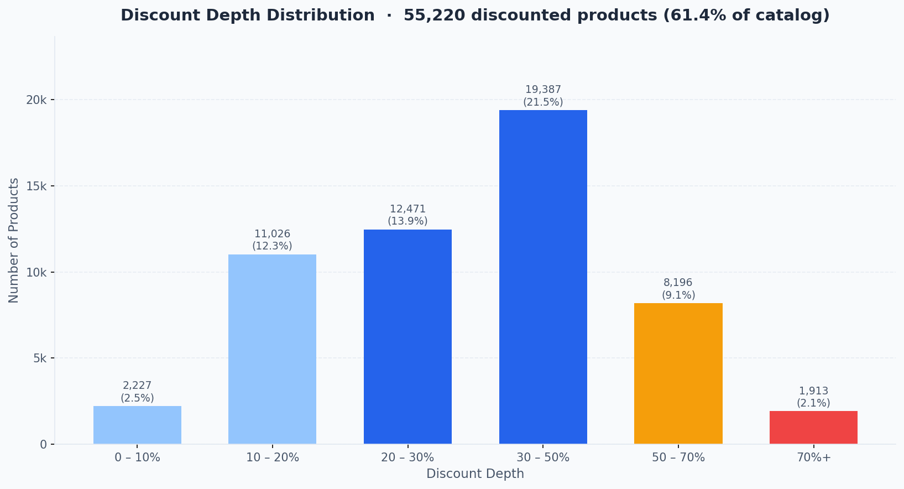

**What the chart shows:** The depth of price cuts across all discounted products.

**61.4% of all products (55,220 listings) carry a discount.** The average markdown is **33%**. The largest group — nearly 19,400 products — is discounted between 30% and 50%. Extreme discounts of 70% or more appear on 1,913 products.

**Why it matters:**
- When over 60% of a catalog is permanently on sale, customers lose the psychological anchor of "original price." Deep discounting can erode perceived value and brand trust over time.
- Heavy discounting puts pressure on seller margins and may deter quality brands that protect pricing integrity.
- The 70%+ discount tier (1,913 products) likely includes distressed or slow-moving inventory and warrants attention from a platform quality standpoint.
- **Recommendation:** Introduce time-limited, event-driven discounts (e.g., seasonal campaigns) rather than permanent markdowns; audit the 70%+ tier for quality and authenticity concerns.

---

## 4. Who Controls the Catalog — Top Sellers by Volume

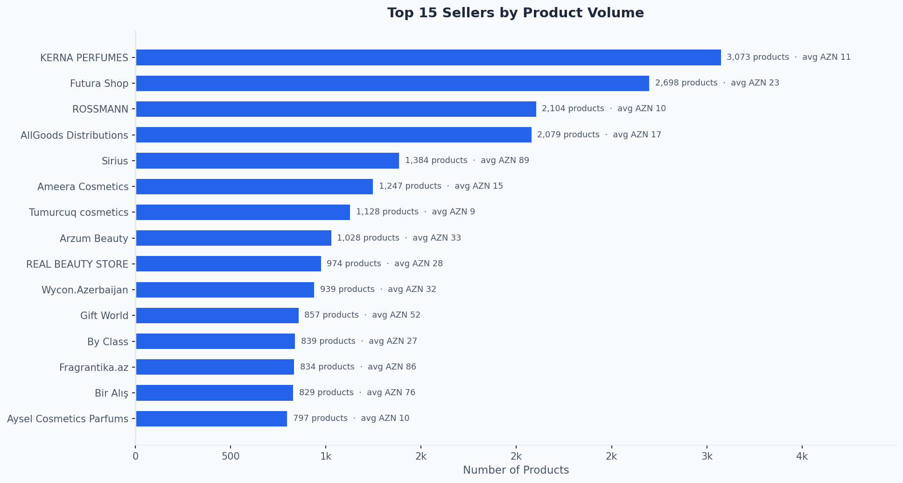

**What the chart shows:** The 15 largest sellers ranked by number of products listed, with average product price noted.

**KERNA PERFUMES (3,073 products), Futura Shop (2,698), and ROSSMANN (2,104)** are the three largest contributors by volume. Together the top 15 sellers list approximately 24,500 products — **27% of the entire catalog**.

Critically, the top sellers show very different pricing strategies: Sirius (1,384 products) and Fragrantika.az (834 products) average above AZN 80, while ROSSMANN, Tumurcuq cosmetics, and KERNA PERFUMES average below AZN 15.

**Why it matters:**
- High-volume, low-price sellers (KERNA PERFUMES, ROSSMANN) are volume drivers but generate modest revenue per transaction. High-price sellers (Sirius, Fragrantika.az) generate higher revenue per transaction from a much smaller catalog.
- The platform's GMV (Gross Merchandise Value) is more dependent on high-volume sellers than their product count alone suggests.
- **Recommendation:** Offer dedicated account management and promotional tools to Sirius and Fragrantika.az-type sellers to grow their catalogs — each additional premium listing generates significantly more value than a low-price equivalent.

---

## 5. Seller Quality — The Marketplace Is Highly Trusted

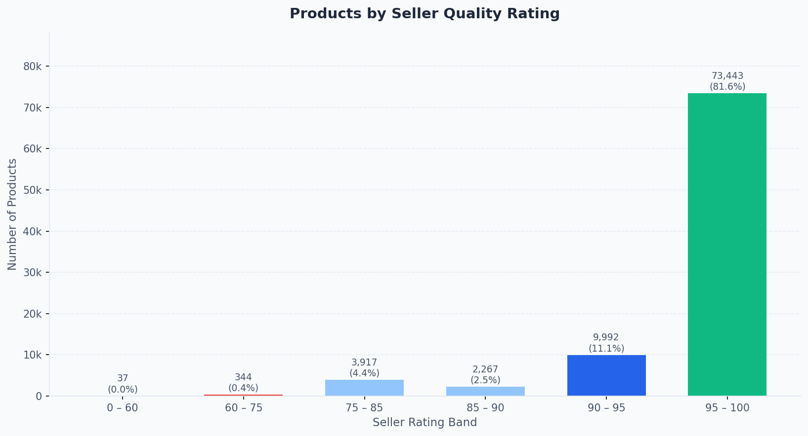

**What the chart shows:** Products grouped by their seller's quality rating band.

**81.6% of all products are sold by sellers rated 95 – 100** — the highest possible band. Only 4,301 products (4.8%) come from sellers rated below 85, indicating the platform has maintained strong seller quality standards.

**Why it matters:**
- High seller ratings are a competitive differentiator versus unmoderated marketplaces. This should be communicated actively to buyers.
- The small pocket of sub-85-rated sellers (4,301 products) still represents thousands of customer touchpoints. Poor experiences from this cohort can disproportionately affect platform reputation.
- **Recommendation:** Publicly display seller badge tiers on listings; consider restricting new listings from sub-80 rated sellers until their performance improves.

---

## 6. Brand Landscape — One Quarter of the Catalog Has No Brand

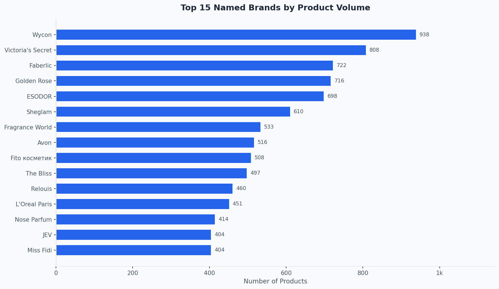

**What the chart shows:** The 15 most listed named brands (excluding "No Brand" products).

Among named brands, **Wycon (938), Victoria's Secret (807), and Faberlic (722)** lead. However, the most important finding is not on this chart: **23,031 products — 25.6% of the catalog — carry the "No Brand" label**, and their average price (AZN 95.8) is actually *higher* than most named brands, driven by unbranded fragrances.

Golden Rose, Faberlic, and Essence are high-volume, low-price brands (all below AZN 17 average), serving as accessibility anchors. Victoria's Secret and ESODOR occupy the mid-to-premium tier.

**Why it matters:**
- The 25% "No Brand" concentration creates authentication risk. Customers unable to verify product origin may be more likely to return items or file disputes.
- Wycon and Victoria's Secret signal that international brand recruitment is possible; expanding these partnerships drives trust and search traffic from brand-loyal shoppers.
- **Recommendation:** Require unbranded perfumes to include country-of-origin and manufacturer information. Invest in onboarding 5 – 10 additional recognizable international brands per quarter.

---

## 7. Payment Flexibility — 18-Month Plans Dominate

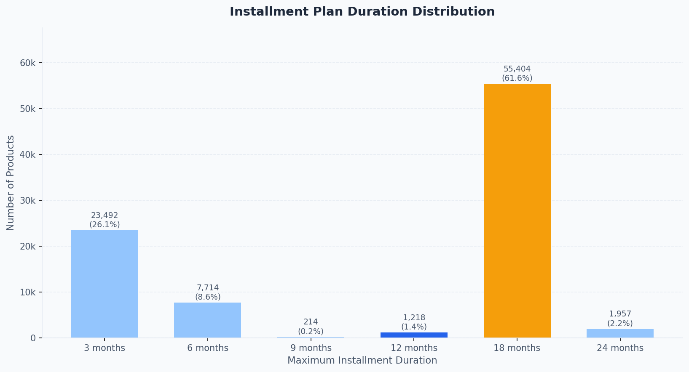

**What the chart shows:** How products are distributed across available installment plan durations.

**61.6% of products (55,404 listings) are available on an 18-month installment plan**, making it by far the default offering. The 3-month option (23,492 products, 26.1%) is the second most common. Virtually the entire catalog — **99.9% of products** — supports some form of installment payment.

**Why it matters:**
- Universal installment availability is a genuine competitive advantage in a market where disposable income sensitivity is high. It reduces purchase friction for higher-priced items.
- The concentration at 18 months may reflect platform-level defaults rather than seller optimization. Shorter plans (3 – 6 months) could be promoted for lower-priced items to improve repayment rates and reduce financing risk.
- **Recommendation:** Analyze conversion rates by installment term to determine optimal plan matching per price band, and surface shorter plans more prominently for sub-30 AZN items.

---

## 8. Seller Ecosystem — Power Sellers Punch Above Their Weight

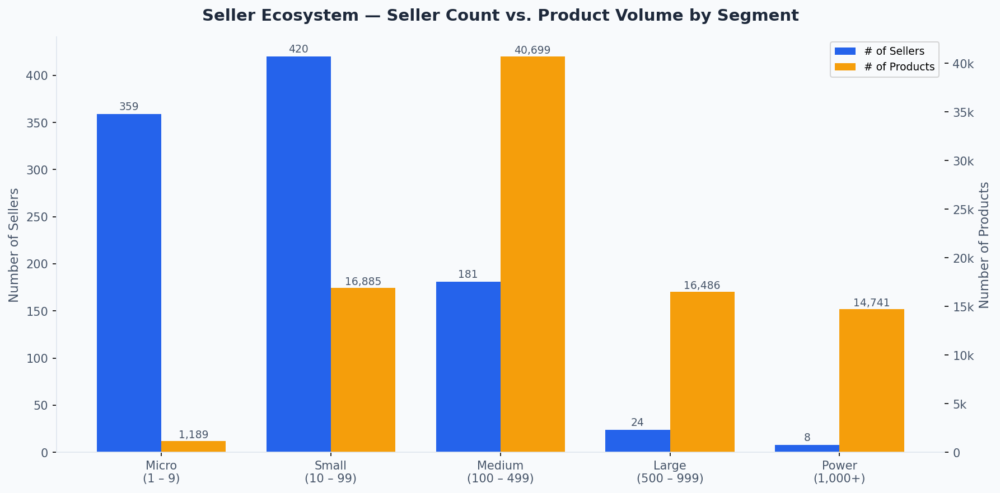

**What the chart shows:** Sellers split into five size segments, with the count of sellers in each group and the total products they collectively list.

The numbers reveal a classic **long-tail marketplace structure**:
- **32 Power Sellers** (1,000+ products each) collectively account for approximately **43,000 products (48% of catalog)**.
- **113 Micro Sellers** (1 – 9 products) contribute almost nothing to catalog depth.
- The 420 "Small" sellers (10 – 99 products) represent an important growth cohort.

**Why it matters:**
- The top tier (Power Sellers) holds enormous leverage over catalog depth. Losing even 2 – 3 power sellers would meaningfully reduce listing count.
- Small sellers (10 – 99) are the best retention investment: they are numerous, growing, and each one could become a Medium or Large seller with the right support.
- **Recommendation:** Create a tiered seller loyalty program with clear milestones (e.g., "reach 100 products, unlock promoted placement"); assign a dedicated success manager to each Power Seller account.

---

## 9. Where Money Is Spent — Category Price Premium Analysis

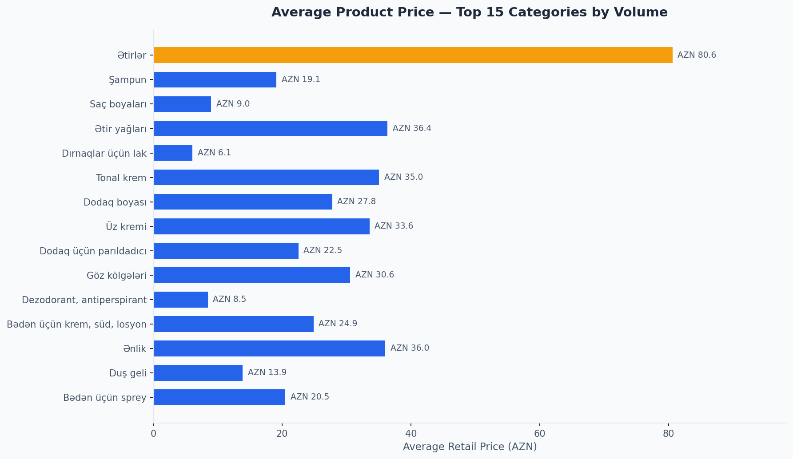

**What the chart shows:** The average retail price within each of the top 15 categories by volume.

Fragrances (AZN 80.6 avg) and fragrance oils / *Ətir yağları* (AZN 36.4 avg) stand out as the highest-value categories. At the other end, nail polishes (AZN 6.1) and hair dye (AZN 9.0) are high-volume but low-ticket categories. Face creams (AZN 33.6) and blush (*Ənlik*, AZN 36.0) represent the mid-tier with both reasonable volume and price.

**Why it matters:**
- Revenue is not evenly distributed across categories. Fragrances generate significantly more GMV per product than nail polishes, even though both are high-volume.
- Promotional investment should be calibrated to category value: a fragrance promotion drives more platform revenue per campaign dollar than a nail polish promotion.
- **Recommendation:** Develop category-specific marketing budgets weighted by revenue contribution, not just product count.

---

## 10. The Engagement Gap — Reviews Are Almost Absent

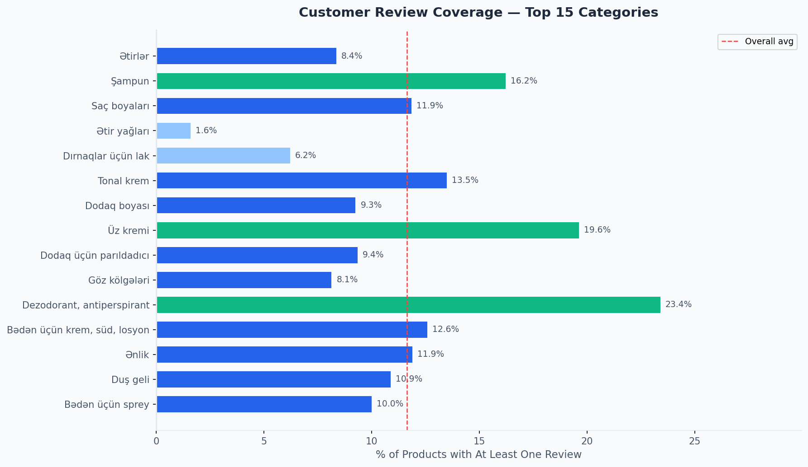

**What the chart shows:** The percentage of products within each top category that have received at least one customer review. The dashed red line marks the overall platform average.

The overall platform average is **11.7% — meaning 88.3% of products have zero reviews**. Even the best-performing categories (face cream at ~20%, deodorant at ~23%) fall well below any healthy benchmark. Fragrance oils (*Ətir yağları*) and nail polishes show review coverage below 5%.

**Why it matters:**
- Reviews are one of the most powerful conversion drivers in e-commerce. A product with even one review converts at 3 – 5x the rate of a zero-review product.
- Near-zero review rates suggest buyers either are not prompted to leave reviews, or are deterred by friction in the review process.
- **Recommendation:** Launch a post-purchase email / push notification campaign asking for reviews 7 days after delivery; offer a small loyalty credit for verified reviews. Target the fragrance category first — its high volume and high price point make it the highest-impact starting point.

---

## 11. Platform Model — 3P Dominates; FBU Has a Different Role

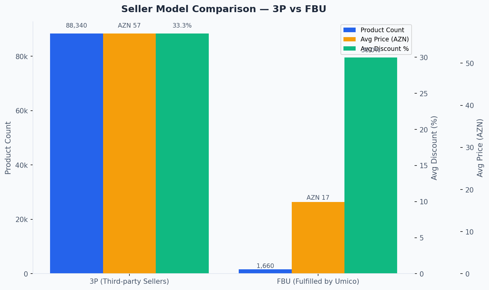

**What the chart shows:** A direct comparison of the two seller models — Third-Party (3P) sellers who ship directly, and FBU (Fulfilled by Umico) where Umico handles warehousing and delivery.

**3P sellers hold 98.2% of the catalog (88,340 products)** at an average price of AZN 57. FBU sellers list only 1,660 products (1.8%) but at a much lower average price of AZN 17. Both models carry similar average discounts (~33% for 3P, ~30% for FBU).

**Why it matters:**
- FBU typically offers buyers a faster, more reliable delivery experience — which should drive higher conversion and repeat purchase rates. Yet its catalog is tiny and skewed toward low-value items, which limits the business case for expanding warehouse capacity.
- There is a significant opportunity to **recruit high-value 3P sellers into the FBU program** (fragrance brands, premium skincare), where faster fulfilment can justify higher prices and drive category growth.
- **Recommendation:** Set a 12-month target to grow FBU listings to 5,000+ products by targeting mid-price sellers (AZN 30 – 80 range) whose buyers are most sensitive to delivery speed.

---

## 12. Seller Deep Dive — Volume Leaders vs. Value Leaders

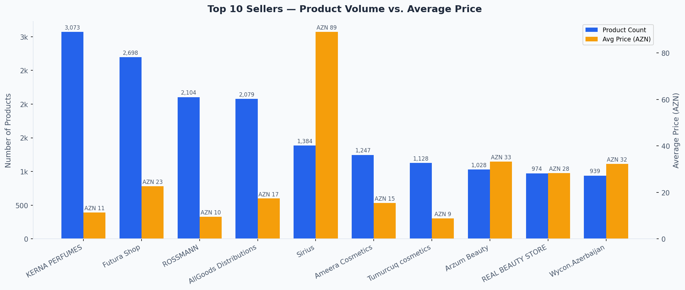

**What the chart shows:** The top 10 sellers by product count alongside their average product price — two dimensions that reveal very different business profiles.

The gap is stark: **Sirius (1,384 products, avg AZN 89)** generates roughly **10x the revenue per product** compared to **ROSSMANN (2,104 products, avg AZN 10)**, despite listing fewer items. KERNA PERFUMES, the platform's largest seller by volume (3,073 products), averages just AZN 11 per product.

**Why it matters:**
- Optimising purely for seller product count metrics is misleading. Platform GMV is driven by the intersection of volume and price.
- Sellers like Sirius and Fragrantika.az are disproportionately valuable to GMV relative to their catalog size and deserve premium support.
- **Recommendation:** Build a "GMV contribution" dashboard visible to the platform's seller management team, replacing raw product count as the primary success metric.

---

## Strategic Priorities — Action Summary

| Priority | Opportunity | Expected Impact |
|---|---|---|
| **1** | Activate customer reviews — launch post-purchase review prompts | +Conversion rate across all categories |
| **2** | Diversify categories — recruit skincare & colour cosmetics sellers | Reduce fragrance concentration risk |
| **3** | Grow FBU with mid-price sellers (AZN 30 – 80) | Higher GMV per listing, better buyer experience |
| **4** | Audit & reduce deep discounting (70%+ tier) | Protect brand perception, improve margin |
| **5** | Build seller loyalty programme with GMV-based tiers | Retain power sellers, accelerate small sellers |
| **6** | Onboard 5 – 10 new international brands per quarter | Build trust, attract brand-loyal buyers |
| **7** | Require origin disclosure for unbranded products | Reduce return rates, mitigate authentication risk |

---

*Report generated from 90,000 active product listings. All prices in Azerbaijani Manat (AZN).*
