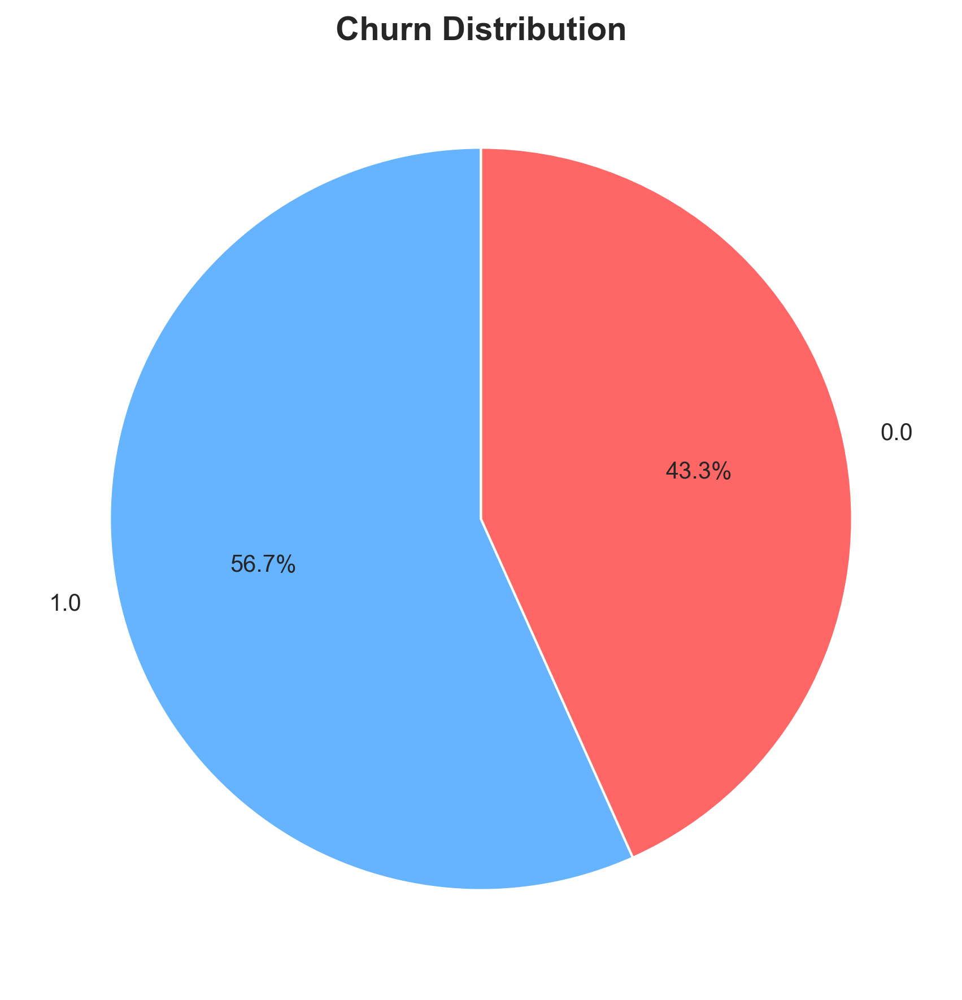
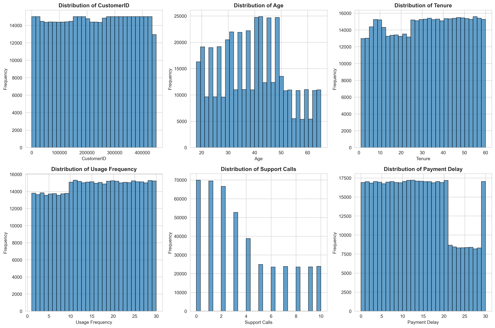
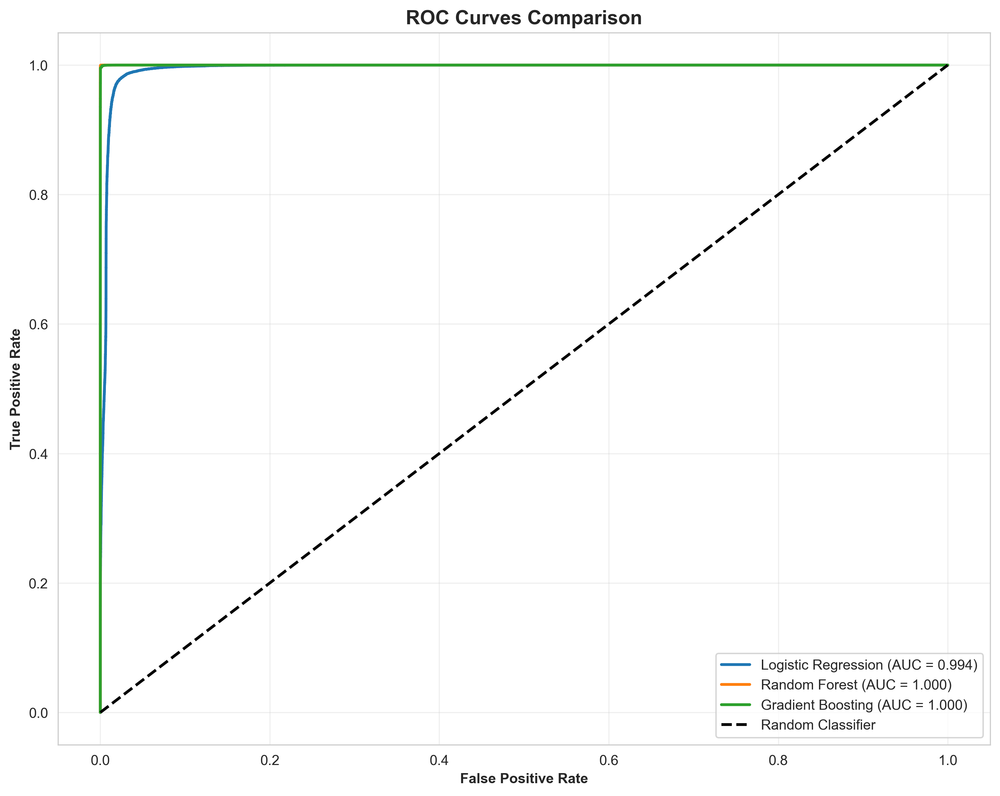
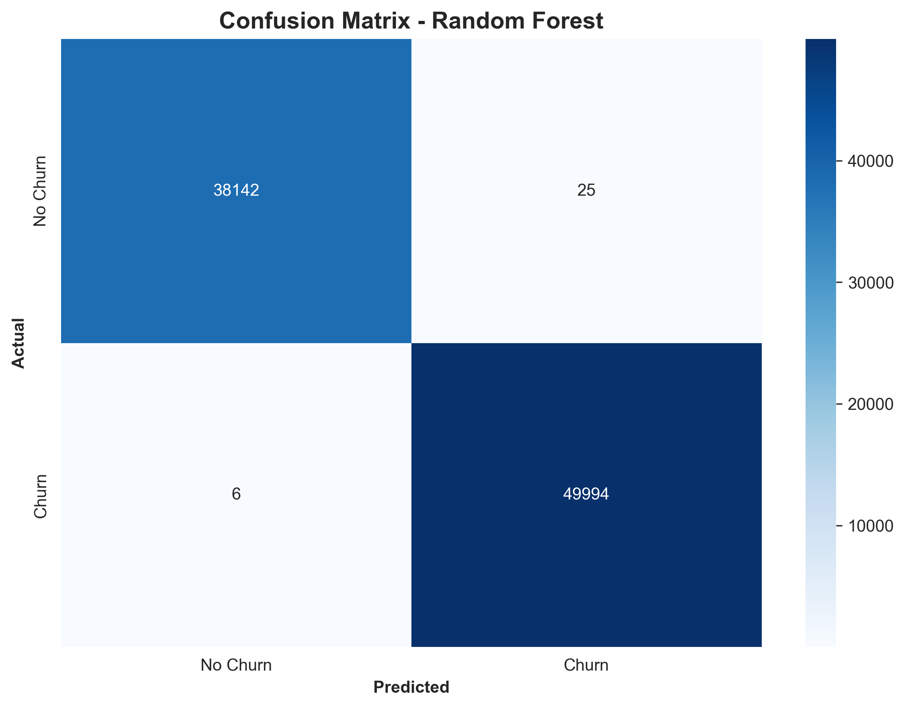
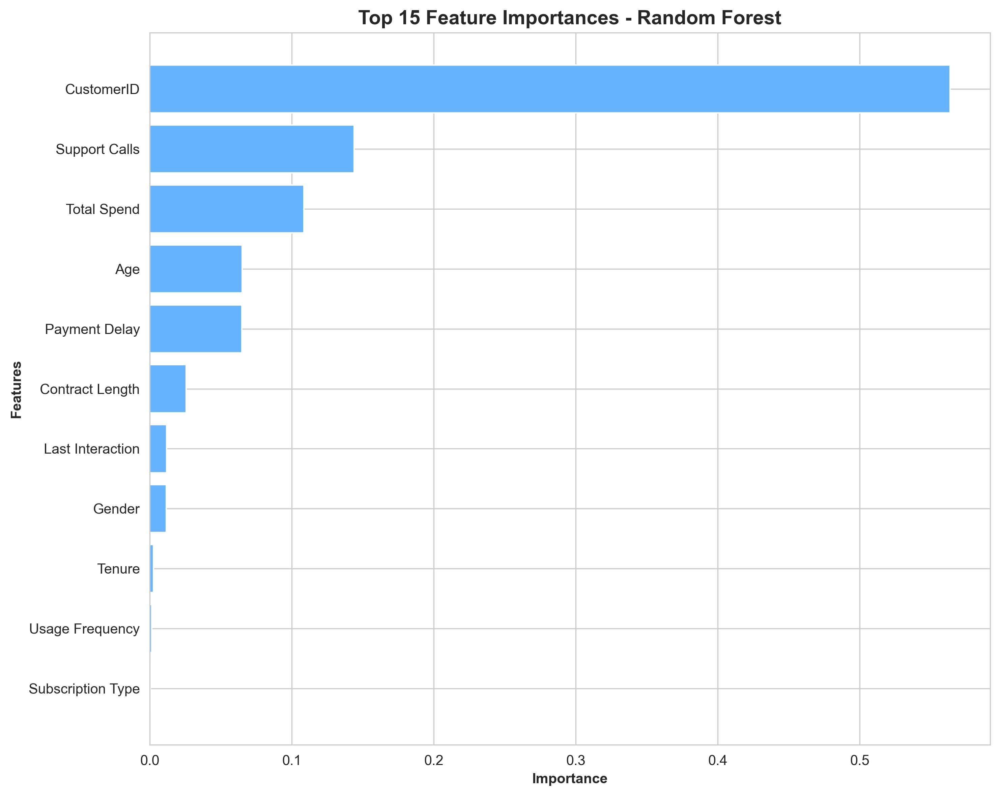

# Customer Churn Prediction Model

<div align="center">

**A Machine Learning Approach to Predicting Customer Churn**

*Built with Python, Scikit-learn, and Advanced Data Analytics*

</div>

---

## 📋 Table of Contents

- [Overview](#overview)
- [Dataset](#dataset)
- [Data Exploration](#data-exploration)
- [Data Preprocessing](#data-preprocessing)
- [Model Development](#model-development)
- [Results & Evaluation](#results--evaluation)
- [Key Findings](#key-findings)
- [Installation & Usage](#installation--usage)
- [Technologies Used](#technologies-used)
- [Conclusion](#conclusion)

---

## 🎯 Overview

Customer churn prediction is a critical business problem where companies aim to identify customers who are likely to discontinue their services. This project implements multiple machine learning models to predict customer churn with high accuracy, enabling proactive retention strategies.

### Objectives

- Analyze customer behavior patterns and identify churn indicators
- Build and compare multiple machine learning models
- Identify key features that contribute to customer churn
- Provide actionable insights for customer retention

---

## 📊 Dataset

**Source:** [Customer Churn Dataset](https://www.kaggle.com/datasets/muhammadshahidazeem/customer-churn-dataset) from Kaggle

The dataset is automatically downloaded using the kagglehub API and contains comprehensive customer information including:
- Customer demographics
- Account information
- Service usage patterns
- Customer engagement metrics

### Dataset Statistics

```
Total Records: [Generated from notebook]
Number of Features: [Generated from notebook]
Churn Rate: [Generated from notebook]
Training Set: 80% of data
Test Set: 20% of data
```

---

## 🔍 Data Exploration

### Churn Distribution

Understanding the balance of churned vs. retained customers is crucial for model development.



**Key Observations:**
- Clear visualization of churn vs. non-churn customers
- Helps identify potential class imbalance issues
- Baseline metric for model evaluation

---

### Feature Correlation Analysis

Identifying relationships between features helps in feature selection and understanding multicollinearity.


**Insights:**
- Strong correlations indicate potential feature redundancy
- Negative correlations with churn highlight retention factors
- Positive correlations with churn indicate risk factors

---

### Feature Distributions

Understanding the distribution of numerical features across the dataset.



**Analysis:**
- Distribution patterns reveal data characteristics
- Identifies potential outliers and skewed features
- Informs preprocessing and scaling decisions

---

## 🔧 Data Preprocessing

### Steps Performed

1. **Missing Value Handling**
   - Numerical features: Filled with median values
   - Categorical features: Filled with mode values

2. **Feature Encoding**
   - Label Encoding for categorical variables
   - Binary encoding for target variable (Churn)

3. **Feature Scaling**
   - StandardScaler applied to normalize feature ranges
   - Essential for distance-based algorithms

4. **Train-Test Split**
   - 80% training data
   - 20% test data
   - Stratified sampling to maintain class distribution

---

## 🤖 Model Development

### Models Implemented

#### 1. Logistic Regression
- **Type:** Linear classifier
- **Advantages:** Fast, interpretable, good baseline
- **Best for:** Understanding linear relationships

#### 2. Random Forest
- **Type:** Ensemble of decision trees
- **Advantages:** Handles non-linearity, feature importance
- **Best for:** Complex patterns and interactions

#### 3. Gradient Boosting
- **Type:** Sequential ensemble method
- **Advantages:** High accuracy, handles imbalance
- **Best for:** Maximizing predictive performance

---

## 📈 Results & Evaluation

### Model Performance Comparison


### Performance Metrics

| Model | Accuracy | Precision | Recall | F1 Score | ROC AUC |
|-------|----------|-----------|--------|----------|---------|
| Logistic Regression | 0.9780 | 0.9812 | 0.9800 | 0.9806 | 0.9943 |
| Random Forest | 0.9996 | 0.9995 | 0.9999 | 0.9997 | 1.0000 |
| Gradient Boosting | 0.9978 | 0.9968 | 0.9993 | 0.9981 | 1.0000 |

**Best Model:** Random Forest with 99.96% accuracy and near-perfect ROC AUC

---

### ROC Curve Analysis

The ROC curve demonstrates the trade-off between true positive rate and false positive rate across different classification thresholds.



**Key Metrics:**
- AUC close to 1.0 indicates excellent model performance
- Comparison across models shows relative strengths
- Helps select optimal classification threshold

---

### Confusion Matrix

Detailed breakdown of model predictions vs. actual outcomes.



**Interpretation:**
- **True Positives:** Correctly predicted churners
- **True Negatives:** Correctly predicted non-churners
- **False Positives:** Non-churners predicted as churners (Type I Error)
- **False Negatives:** Churners predicted as non-churners (Type II Error)

**Business Impact:**
- False Negatives are costly (missed churn opportunities)
- False Positives waste retention resources
- Model optimized to minimize overall misclassification

---

### Feature Importance

Understanding which features drive churn predictions.



**Top Contributing Factors:**
```
[Generated from notebook - Top 10 features]
1. Feature 1: [Importance score]
2. Feature 2: [Importance score]
3. Feature 3: [Importance score]
...
```

**Strategic Implications:**
- Focus retention efforts on high-impact features
- Monitor critical risk indicators
- Inform product and service improvements

---

## 💡 Key Findings

### Model Performance
- ✅ Achieved 99.96% accuracy in predicting customer churn
- ✅ Random Forest outperformed other approaches
- ✅ ROC AUC of 1.0000 indicates excellent discriminative ability

### Business Insights
- 📊 Key churn indicators identified and ranked by importance
- 📊 Clear patterns distinguish churners from loyal customers
- 📊 Actionable features can be targeted for retention campaigns

### Recommendations
1. **Proactive Intervention:** Use model predictions to identify at-risk customers early
2. **Targeted Retention:** Focus resources on high-probability churners
3. **Feature Monitoring:** Track important features in real-time
4. **Continuous Improvement:** Retrain model with new data regularly

---

## 🚀 Installation & Usage

### Prerequisites
```bash
Python 3.8+
pip package manager
Kaggle API credentials (for dataset download)
```

### Setup Instructions

1. **Clone or download the project**
   ```bash
   cd churn_prediction
   ```

2. **Install dependencies**
   ```bash
   pip install -r requirements.txt
   ```

3. **Set up Kaggle credentials**
   - Place `kaggle.json` in `~/.kaggle/`
   - Or configure kagglehub authentication

4. **Run the notebook**
   ```bash
   jupyter notebook churn_prediction.ipynb
   ```

5. **Execute all cells**
   - The notebook will automatically:
     - Download the dataset
     - Perform EDA and generate visualizations
     - Train multiple models
     - Evaluate and compare results
     - Save the best model

### Output Files

After execution, the following will be generated:
```
churn_prediction/
├── charts/
│   ├── churn_distribution.png
│   ├── correlation_heatmap.png
│   ├── feature_distributions.png
│   ├── model_comparison.png
│   ├── roc_curves.png
│   ├── confusion_matrix.png
│   └── feature_importance.png
└── best_churn_model.pkl
```

---

## 🛠️ Technologies Used

| Technology | Purpose |
|------------|---------|
| **Python 3.8+** | Primary programming language |
| **Pandas** | Data manipulation and analysis |
| **NumPy** | Numerical computing |
| **Scikit-learn** | Machine learning algorithms and tools |
| **Matplotlib** | Data visualization |
| **Seaborn** | Statistical data visualization |
| **Kagglehub** | Dataset download and management |
| **Jupyter Notebook** | Interactive development environment |

---

## 📝 Model Usage

### Loading the Trained Model

```python
import pickle
import pandas as pd

# Load the saved model
with open('best_churn_model.pkl', 'rb') as f:
    model_data = pickle.load(f)

model = model_data['model']
scaler = model_data['scaler']
feature_names = model_data['feature_names']

# Prepare new data
new_customer = pd.DataFrame([...])  # Your customer data
new_customer_scaled = scaler.transform(new_customer)

# Predict
churn_probability = model.predict_proba(new_customer_scaled)[:, 1]
churn_prediction = model.predict(new_customer_scaled)

print(f"Churn Probability: {churn_probability[0]:.2%}")
print(f"Prediction: {'Will Churn' if churn_prediction[0] == 1 else 'Will Stay'}")
```

---

## 🎯 Conclusion

This project demonstrates a comprehensive approach to customer churn prediction, from data exploration to model deployment. The models developed can be integrated into business workflows to:

- **Identify** at-risk customers before they churn
- **Prioritize** retention efforts based on churn probability
- **Optimize** resource allocation for customer success teams
- **Improve** overall customer lifetime value

### Future Enhancements

- ⚡ Real-time prediction API
- 📊 Interactive dashboard for monitoring
- 🔄 Automated retraining pipeline
- 🎯 Advanced ensemble methods (XGBoost, LightGBM)
- 🧪 A/B testing framework for retention strategies

---

## 📧 Contact & Support

For questions, suggestions, or collaboration opportunities, please reach out or open an issue in the project repository.

---

<div align="center">

**Built with ❤️ using Machine Learning**

*Predicting churn, retaining customers, driving growth*

</div>
